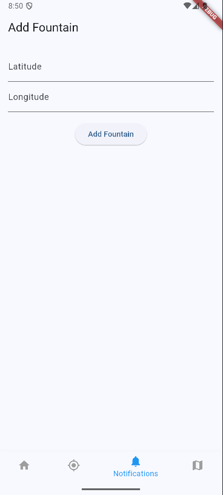

# MADProject

## Workspace 
GitHub:  
- Repository: https://github.com/dtsekov/DrinkingWaterNavigation
- Releases: https://github.com/dtsekov/DrinkingWaterNavigation/releases   

Workspace: https://upm365.sharepoint.com/sites/MADProject/SitePages/Tracking(1).aspx
  

## Description
The application provides a fast and convenient way to find a nearby source of drinking water. In addition to offering other features, the main focus of the app is to display the closest drinking water fountains and, upon selecting one, show the shortest route to reach it. Such applications are typically developed by companies that display only their own water fountains. In contrast, my application uses the data from an open database from the city of Madrid to show all available public drinking fountains. It also allows the user to add their own custom ones if they wish. By focusing exclusively on drinking water fountains, it simplifies the process of finding one, making it quick, easy, and efficient. It is developed in flutter meaning it can compile into an android app, ios app, or even windows app.

## Screenshots and navigation

<table>
  <tr>
    <td>
      
      
This is the screen that greets you when you first install the app, you will need to enter a valid email and password registered inside your firebase authorization module to be able to login into the app.

    </td>
    <td>
      
      
This is the initial configuration screen that appears on first login, here you will need to fill in the necessary settings, your Realtime Database url from your firebase module, this is made so if you want to use another database thats not the one determined in your firebase config files you can choose to use another one by putting the url, this is mandantory as the app will not work without a proper database url configured. Then you will define your UserID and after that your Weather API Token which the app needs to show you weather information from the open weather api. When you press on Save & Initialize the app will save these values to shared preferences and also seed your database with all the drinking water fountain coordinates in Madrid.

    </td>
  </tr>
  <tr>
    <td>
      
      
This is the main screen. From here we can activate our location permissions by pressing the switch button. Upon pressing you will be prompted to grant permission for the app to use your location. Also the app will show you the weather information in your current location after pressing the button. From here you can press on the settings wheel in the top left corner which will navigate to the Settings screen, or you can use the bottom navigation to go to the Fountains Screen, Add Fountain screen or the Map Screen, and also the Home Screen.

    </td>
    <td>
      
      
This is the Settings Screen, in here you can modify any value from your settings and save them, the app then updates the shared preferences values. You can also press on Reseed Database if you delete the fountains from your database or choose to use a diffrent one and need to populate it again. Also from this screen you can logout from the application.

    </td>
  </tr>
  <tr>
    <td>
      
      
This is the fountains screen, in here you will be shown a list with all the fountains inside your database. Besides browsing them you can press on any one of them to delete a fountain, and long press or hold on one of them to edit the fountain latitude or longitude inside the database.

    </td>
    <td>
       
      
This is the Add Fountain Screen, in here you can add your own fountain that will later appear on the map, this is for if you find a drinking water fountain that doesnt appear on the map already, you can add it to the database and it will appear on your map.

    </td>
  </tr>
  <tr>
    <td>
      
      
This is the Map screen, in this image we have location permissions disabled so it defaults to Madrid center in the next image we will show the current location and routing looks. The blue water droplets are the drinking water fountains. You can press on one to display the shortest route from your current location to one of them.

    </td>
    <td>
      
      
Here we can see a Red Marker that displays our current location, and also a Blue Water Droplet that represents a drinking water fountain, the purple polyline is the shortest route to the fountain that the app painted on the map.

    </td>
  </tr>
  
</table>

## Demo Video
 
<a href="https://upm365-my.sharepoint.com/:v:/g/personal/d_tsekov_alumnos_upm_es/ERQ2tXoCaO9Es9po-dAKf2ABtWHTE7xrH_Tzrun11_9_bQ?e=uQ0dDx&nav=eyJyZWZlcnJhbEluZm8iOnsicmVmZXJyYWxBcHAiOiJTdHJlYW1XZWJBcHAiLCJyZWZlcnJhbFZpZXciOiJTaGFyZURpYWxvZy1MaW5rIiwicmVmZXJyYWxBcHBQbGF0Zm9ybSI6IldlYiIsInJlZmVycmFsTW9kZSI6InZpZXcifX0%3D">
Demo video of the app. 
</a>

## Features
**Functional**
- Search for drinking water fountains in Madrid.
- Shortest route to water fountains.
- Real-time weather information.
- Storage of fountains in realtime database.
- Can modify or delete fountains and also add them in database.

**Technical**
- Persistence in shared preferences Ref: [Source code](https://github.com/dtsekov/DrinkingWaterNavigation/blob/master/lib/screens/initial_config_screen.dart)
- Persistence in Realtime Database using firebase. Ref: [Source code](https://github.com/dtsekov/DrinkingWaterNavigation/blob/master/lib/firebase_seeder.dart)
- Maps: Openstreetmaps. Ref: [Source code](https://github.com/dtsekov/DrinkingWaterNavigation/blob/master/lib/screens/map_screen.dart)
- Restful API Openweathermaps, we use a get call to open weather maps giving them our current location and getting in return weather information. Ref: [Source code](https://github.com/dtsekov/DrinkingWaterNavigation/blob/master/lib/screens/splash_screen.dart)
- Restful API OSRM, used to get the coordinates list of the shortest route to drinking fountains from current location so we can paint it on the map. Ref: [Source code](https://github.com/dtsekov/DrinkingWaterNavigation/blob/master/lib/screens/map_screen.dart)
- Menu: Settings: [Source code](https://github.com/dtsekov/DrinkingWaterNavigation/blob/master/lib/screens/settings_screen.dart)
- Menu: Bottom navigation Ref: [Source code](https://github.com/dtsekov/DrinkingWaterNavigation/blob/master/lib/main_screen.dart)
- Sensors: GPS coordinates to access current location
- Authorization using Firebase Authorization: [Source code](https://github.com/dtsekov/DrinkingWaterNavigation/blob/master/lib/login_screen.dart)

## How to Use
The only users that can use the app are those that are registered in the Firebase Authorization module that the app is connected to. At the start the user will be prompted to enter their email and password to login. After logging in the user will have to fill some initial settings to make the app work. First of all is the url for the Firebase Database, this way the user can even use their own one if they want, then their User ID, and a valid API Key to access open weather api for weather information. After pressing Save & Initialize the app will seed the database if it is not already seeded. When in the main screen the user will have to press on the switch button to give location permissions for the app, after that the user can navigate to any screen and access the corresponding functionality with the bottom navigation bar, or the settings icon in the top left of the home screen. In the Fountains Screen the user can modify or delete any fountain coordinate in the database. In the Add Fountain screen they can add their own custom fountain that will appear on the map. In the map screen the user will see all the fountains from the database loaded as Blue Water Droplets Markers. After pressing on one of them the application will paint the shortest path to that drinking water fountain from their current location if they have the location permissions activated.

## Participants
List of MAD developers:
- Dimitar Danielov Tsekov  (d.tsekov@alumnos.upm.es)  
